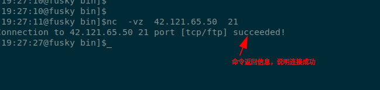
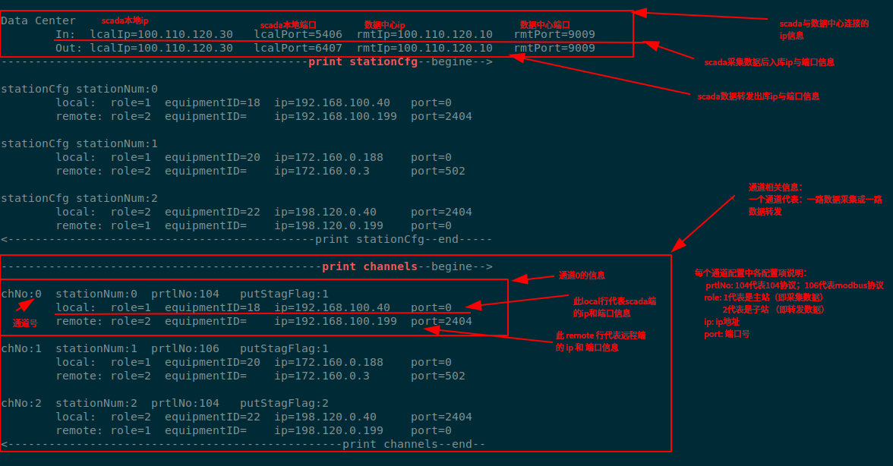
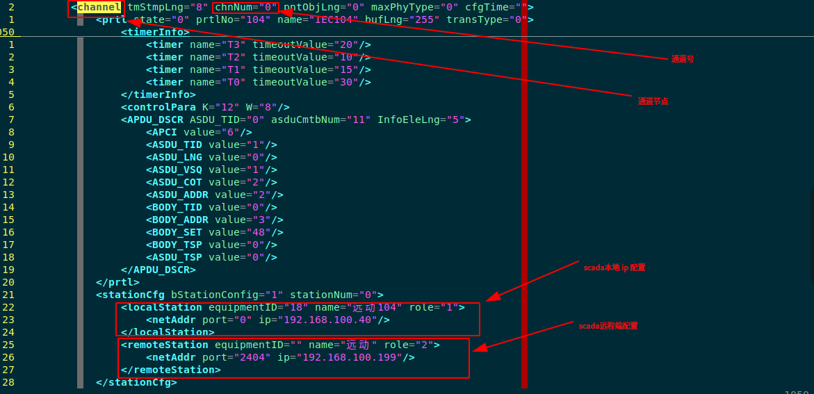
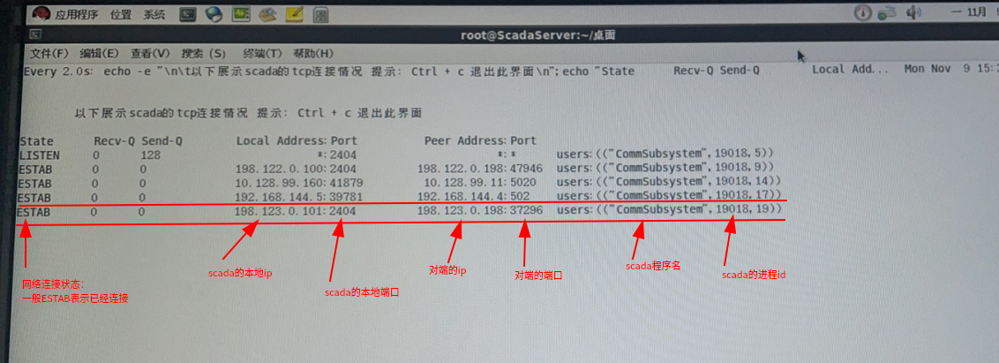
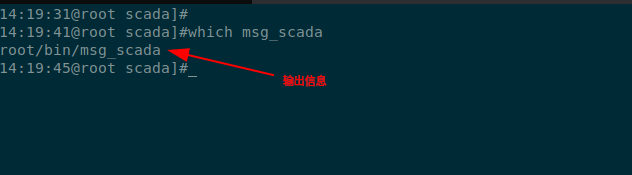
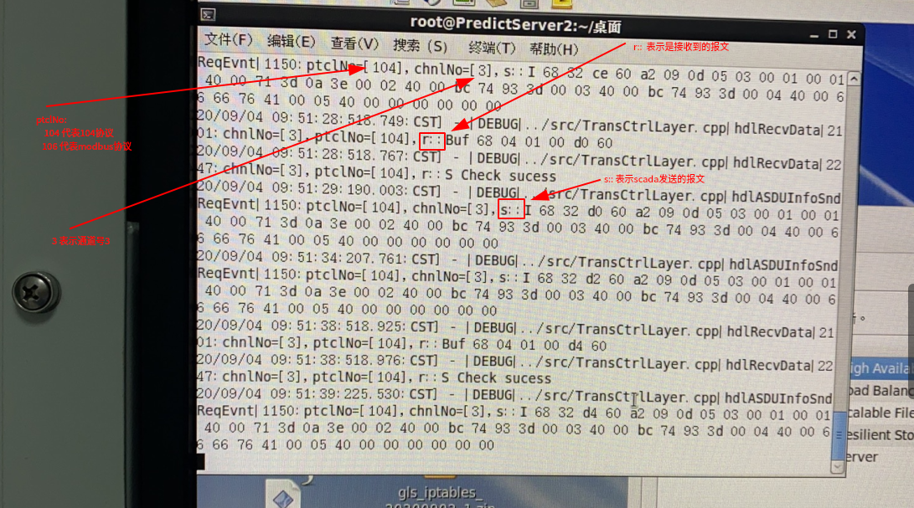
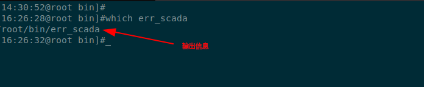
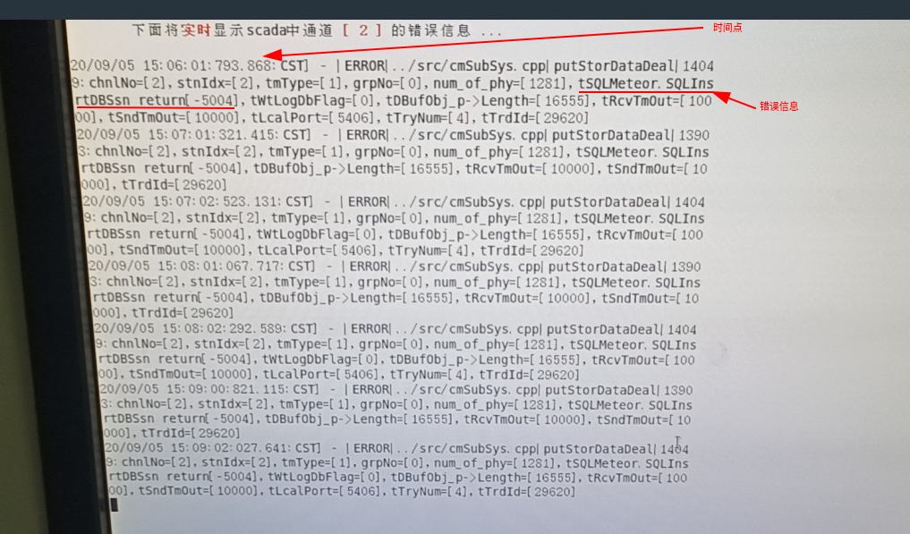
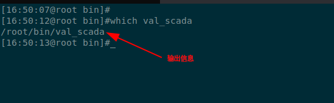
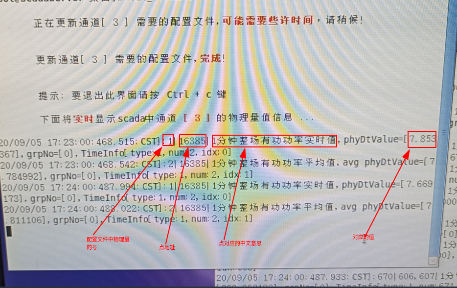

# scada问题定位及辅助工具使用说明

**作者**: fusky

**摘要**: scada是后台程序没有界面，排查问题较有图形界面的软件困难,此文档介绍了定
      位问题的推荐顺序及主要工具的使用方法，可以帮助相关人员更容易定位到问题。


**编写日期**: 2020-11-23


---

## 目录

+ [1. 典型问题定位](#典型问题定位)

>   - [1.1 问题定位顺序参考](#问题定位顺序参考)
>
>   - [1.2 常用命令](#常用命令)
>
>>  - [1.2.1 nc命令](#nc命令)
>

+ [2. 各工具使用说明](#各工具使用说明)

>   - [2.1 opScdCfg查询ip相关配置信息](#opScdCfg查询ip相关配置信息)
>
>   - [2.2 ss_scada网络连接查询](#ss_scada网络连接查询)
>
>   - [2.3 msg_scada查看对应通道号的收发报文](#msg_scada查看对应通道号的收发报文)
>
>   - [2.4 err_scada查看scada错误信息](#err_scada查看scada错误信息)
>
>   - [2.5 val_scada查看scada通道收或发值](#val_scada查看scada通道收或发值)
>

---

## 1
## 典型问题定位

### 1.1
### 问题定位顺序参考

1.  确定数据采集的ip地址。

2.  知道了ip地址通过[2.1 opScdCfg](#opScdCfg查询ip相关配置信息)
    查找对应通道号。

3.  查看采集通道对通道的网络连接是否正常
   （通过[2.2 ss_scada](#ss_scada网络连接查询)这个工具来查询）。   

4.  查看对应通道号是否有正常的报文（通过
    [2.3 msg_scada](#msg_scada查看对应通道号的收发报文)工具查询）。

5.  查看[2.5 val_scada](#val_scada查看scada错误信息)工具查看对应通道的值是否正常。

6.  查看通道是否有明显错误信息（通过[2.4 err_scaa](#err_scada查看scada错误信息)工具查询）。

7.  如果都正常则查看java前台界面的曲线是否正常。

通过如上步骤的的排查，一般都可以定位问题所在了。
  

> [返回目录](#目录)

---

### 1.2
### 常用命令

#### 1.2.1
#### nc命令

此命令在此文档主要来用是诊断网络连通性,具体到scada中主要用来测试scada作为主站，
远程站作为被动站（子站）时scada到子站固定端口的联通性，常用形式如下几种：

- 不带源地址和源端口的网络连通测试用命令:`nc 目标ip 目标端口` 

> ```shell
>     #eg:测试 当前主机到 42.121.65.50 这个机器 端口21是否连通
>     nc  -vz  42.121.65.50  21
> ```
> 返回结果类似如下图则说明是连通的:
>
> 


-   在某些环境中有防火墙则限制，需要有从固定ip或固定ip且固定端口连通目标ip与端口
    的网络连通测试用命令:

> ```shell
>     #eg:需要从固定源ip连通
>     nc -s 本地源ip地址   -vz 远程ip  远程端口
>     #eg:需要从固定源ip和固定源端口连通
>     nc -s 本地源ip地址 -p 本地源端口号  -vz 远程ip  远程端口
> ```
> 返回结果类似如下图则说明是连通的:
>
> 
>


> [返回目录](#目录)


## 2
## 各工具使用说明

**注意**:

  1. 如无特殊说明则各工具的使用都应在root用户下使用。
  2. 如果要退出输出信息界面只需要按`Ctrl + c`键即可。

---

### 2.1
### opScdCfg查询ip相关配置信息

首先在终端输入命令`which opScdCfg.sh`查看scada主机器是否有opScdCfg.sh工具


-   如图所示则表示在当前环境中有opScdCfg.sh工具，可以直接在终端中（无论什么路径
    下都可以）使用如下命令查询相应信息。

> ```shell
>    cd /zfmd/wpfs20/scada
>    #scdCfg.xml是配置文件名，可以根据实际情况修改
>    opScdCfg.sh prt scdCfg.xml
> ```
> 
> opScdCfg.sh prt scdCfg.xml 输出信息如下：
>
> 
>
> 其中channels中包括的信息是通道相关信息是最常用到的。 

-   如果环境中没有opScdCfg.sh工具则可以在终端中输入如下命令打开scada配置文件
    查看对应通道ip配置：

> ```shell
>     cd /zfmd/wpfs20/scada
>    #scdCfg.xml是配置文件名，可以根据实际情况修改
>     gedit scdCfg.xml
> ```
> 在打开的文件中先查找channels节点：chnNum为通道号；然后查找对应channels节点下
> stationCfg节点为通道下ip配置
> 
> 
> 
> 如果当前查看通道配置下的ip不是要查找的ip则查找下一个channels节点直到查到为止。

> [返回目录](#目录)
---

### 2.2
### ss_scada网络连接查询

首先在终端输入命令`which ss_scada`查看scada主机器是否有ss_scada工具


如图所示则表示在当前环境中有ss_scada工具，可以直接在终端中（无论什么路径下都可以）
使用`ss_scada`按回车键即可。

如果环境中没有ss_scada工具可以在终端中输入如下命令替代ss_scada工具：

```shell
    watch -n 2 -d 'ss -antp|grep CommSubsystem|grep -v "127.0.0.1"'
```

ss_scada输出信息包括，scada的`进程ID`,各通道网络连接情况，具体信息如下图所示：



如果输出信息中没有对应ip信息则说明对应ip通道没有网络连接。


> [返回目录](#目录)

---

### 2.3
### msg_scada查看对应通道号的收发报文

首先在终端输入命令`which msg_scada`查看scada主机器是否有msg_scada工具



如图所示则表示在当前环境中有msg_scada工具，可以直接在终端中（无论什么路径下都可以）
使用`msg_scada 通道号`按回车键即可,其中的通道号可以通过[opScdCfg工具](#opScdCfg查询ip相关配置信息)查找对应
ip及ip对应的通道号来确定。

如果环境中没有msg_scada工具可以在终端中输入如下命令替代msg_scada工具：

```shell
    cd /zfmd/wpfs20/scada/trylog/
    # 在实际使用中0替换成要查找的通道号即可
    tail -f *.txt|grep "chnlNo=\[0\]"|egrep "(r::|s::)"
```

msg_scada的输出信息有时需要等待1分钟左右，当遇到此信息时知道是正常情况即可，
具体信息如下图所示：



上图的示例是输入`msg_scada 3`后的输出。


> [返回目录](#目录)

---

### 2.4
### err_scada查看scada错误信息

首先在终端输入命令`which err_scada`查看scada主机器是否有err_scada工具



如图所示则表示在当前环境中有err_scada工具，可以直接在终端中（无论什么路径下都可以）
使用

(1). `err_scada 通道号`按回车键查看某个通道的错误信息,其中的通道号可以通
     过[opScdCfg工具](#opScdCfg查询ip相关配置信息)查找对应ip及ip对应的通
     道号来确定。

(2). `err_scada`按回车键查看scada的所有错误信息。

如果环境中没有err_scada工具可以在终端中输入如下命令替代err_scada工具：

```shell
    cd /zfmd/wpfs20/scada/trylog/
    # (1)查看某个通道的错误，在实际使用中0替换成要查找的通道号即可
    tail -f *.txt|grep "chnlNo=\[0\]"|grep "ERROR"
    # (2)查看所有的错误
    tail -f *.txt|grep "ERROR"
```

err_scada的无输入信息则表示无信息信息（如果有错误信息大多一1分钟内就会有输出）



上图的示例是输入`err_scada 2`后的输出。


> [返回目录](#目录)


---

### 2.5
### val_scada查看scada通道收或发值

首先在终端输入命令`which val_scada`查看scada主机器是否有val_scada工具



如图所示则表示在当前环境中有val_scada工具，可以直接在终端中（无论什么路径下都可以）
使用`val_scada 通道号`按回车键查看某个通道的收或发值信息,其中的通道号可以通过
[opScdCfg工具](#opScdCfg查询ip相关配置信息)查找对应ip及ip对应的通道号来确定。

val_scada的输出信息有时需要等待1分钟左右，当遇到此信息时知道是正常情况即可，
具体信息如下图所示：



上图的示例是输入`val_scada 3`后的输出。

***TIPS:如果某个通道0值太多可以输入命令`val_scada 通道号 "nonull"`查看非0值输出***


> [返回目录](#目录)

